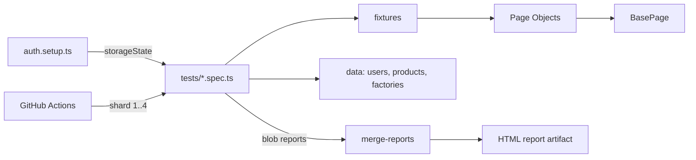

# Playwright + TypeScript UI Test Framework

[](https://github.com/sci-sameena/playwright-ts-framework/actions/workflows/playwright.yml)

A production-style end-to-end test framework for an e-commerce app ([saucedemo.com](https://www.saucedemo.com)), built to show how I'd structure UI automation on a real team: fast, parallel, cross-browser, and readable.

**Highlights:** Page Object Model with fixture injection · session reuse via auth setup · data-driven tests · Faker test data · accessibility scanning with axe-core · 4-way sharded CI with merged reports · Dockerized runs · lint + typecheck gates.

## Architecture



```
src/
  pages/      Page objects (one class per screen, extends BasePage)
  fixtures/   Extends Playwright's test with page-object fixtures
  data/       Users, product catalog, Faker factories
  utils/      Pure helpers (price parsing, slugs)
tests/
  setup/      Logs in once, saves session for all other tests
  auth/       Login: happy path, negative cases, route protection
  inventory/  Sorting (data-driven)
  cart/       Add/remove, badge state, persistence
  checkout/   E2E order, totals math, field validation
  a11y/       WCAG 2 A/AA scans with allowlist for known issues
```

## Quick start

```bash
npm ci
npx playwright install --with-deps
npm test              # all browsers
npm run test:smoke    # @smoke tagged only
npm run test:ui       # interactive UI mode
npm run report        # open last HTML report
```

With Docker:

```bash
docker build -t pw-tests . && docker run --rm pw-tests
```

Configure via `.env` (see `.env.example`).

## Design decisions

**Fixtures over `new Page()` in tests.** Page objects are injected as fixtures, so tests read like specs and setup lives in one place.

**Log in once, not per test.** A `setup` project authenticates and saves `storageState`; browser projects depend on it. This cuts runtime and keeps login coverage isolated to `tests/auth`, which opts out with an empty storage state.

**`data-test` locators.** `testIdAttribute` is set to the app's `data-test` attribute, so locators survive styling and copy changes. No XPath, no CSS chains.

**No hard waits.** Only web-first assertions (`toHaveText`, `toBeVisible`) that auto-retry. `no-wait-for-timeout` is a lint error.

**Data-driven negative tests.** Login errors, sort orders, and required fields are table-driven loops: adding a case is one line.

**Generated test data.** Faker factories with overrides (`buildCustomer({ firstName: '' })`) so tests never share state and edge cases are explicit.

**Assert business logic, not just UI.** The totals test recomputes the subtotal from the product catalog and checks `total = subtotal + tax`.

**Accessibility as a gate with an allowlist.** New serious/critical violations fail the build; known issues are allowlisted with a ticket reference so debt stays visible without blocking every PR.

**Flake handling.** Retries run only in CI, and traces are captured on first retry, so a flaky test shows up in the report with a trace instead of silently passing.

**CI built for scale.** Lint and typecheck gate the run, tests shard across 4 jobs, blob reports merge into a single HTML report, a nightly cron catches environment drift, and `concurrency` cancels superseded runs.

## Running against another environment

```bash
BASE_URL=https://staging.example.com npm test
```
